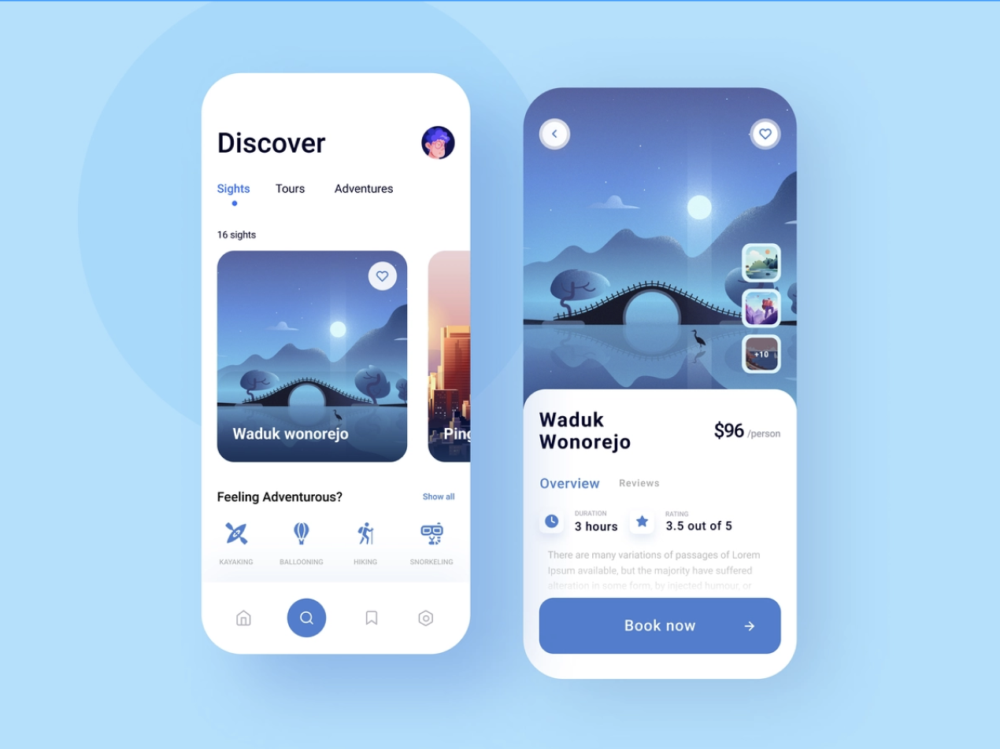
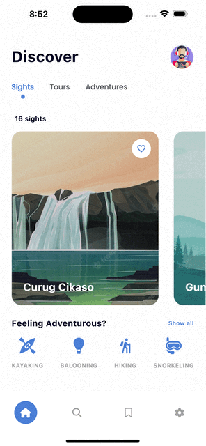

# UI PRO 1 FIC 2 Project

## The Flutter project that cloning an UI from figma
Let me show you my cloning ui from figma into the real app with flutter that is able to run on both android and ios platforms. This is the first design that i cloned from **[Flutter Magic Book](https://www.figma.com/file/PreoFlFsdSfKIGFpNGwaT8/Flutter-MagicBook?node-id=305%3A189&t=vL19qSn0gqQ9jrib-0)**, for more design you are able to visit that link.

## Cloning Result
`=== From this design ===`

`=== Into ===`

| Android                                                                | iOS                                                                |
| ---------------------------------------------------------------------- | ------------------------------------------------------------------ |
|  |  |

## Installing Instruction
If you would like to **try** this app into your device, please **follow the steps** \: 

1. `Clone` or `Download` this repository then save to your diretory.
2. Open directory that was downloaded with your `text editor`.
3. Be sure you are in **UI-PRO-1** `[branch]`, if you are not in **UI-PRO-1** `[branch]`, you can switch to the branch with `git switch UI-PRO-1`.
4. `Pub get` the project, wait until finished. 
5. Run.